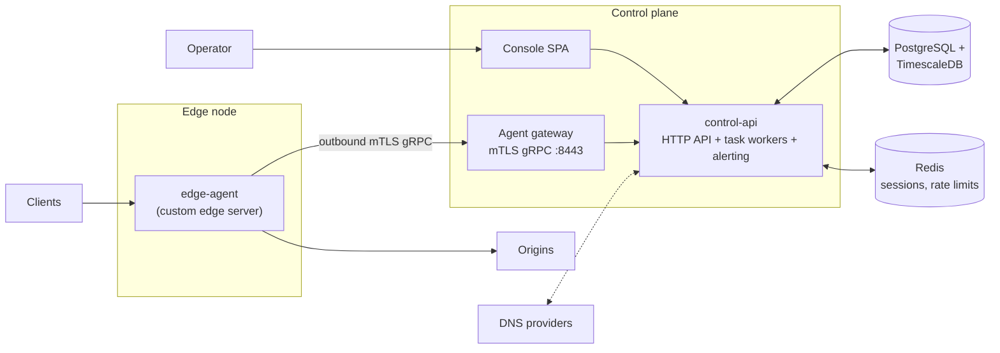

# Goveto Edge

[](https://github.com/goveto-labs/goveto-edge/actions/workflows/ci.yml)

Goveto Edge is a self-hosted, open-source CDN control plane. A Go control
plane with a built-in web console manages sites, certificates, caching, WAF
and DNS; edge nodes run `edge-agent`, a heavily customized edge server built
on the [Caddy](https://caddyserver.com/) Go libraries.

## Highlights

- **Control plane / data plane split.** Edge nodes run `edge-agent`, a
  heavily customized edge server built on the Caddy Go libraries, and it
  connects *outbound* to the control plane over a mutually authenticated
  (mTLS) gRPC management channel — no inbound holes on edge nodes.
- **Site delivery policies.** Sites, domains, listeners, origin pools,
  certificates, cache rules, compression and delivery settings, published to
  nodes through a PostgreSQL-backed job queue with retries, dead-letter and
  execution history.
- **Caching.** Request coalescing, stale serving, Range requests, Vary, and
  query/cookie-aware cache keys, implemented as custom Caddy modules.
- **Security.** Custom rule and regular-expression WAF, distributed rate
  limiting, GeoIP rules, proof-of-work / CAPTCHA challenges, automatic
  banning.
- **Certificates.** ACME HTTP-01 and DNS-01 issuance, automatic renewal,
  revocation, publish and rollback.
- **DNS.** Aliyun and Cloudflare providers, node address synchronization,
  health-aware scheduling with hysteresis, planned changes, snapshots and
  rollback.
- **Observability.** TimescaleDB access-log analytics (WAF, geo, ISP, per-node
  dimensions), real-time logs, CSV export, Prometheus metrics, and an
  alerting engine wired into notification channels (shoutrrr, Bark, Gotify,
  ntfy, SMTP, generic webhook).
- **Operations.** RBAC with cluster scoping, audit log, task queue with
  offline-node recovery, agent auto-upgrade with versioned artifacts and
  rollback.
- **Console.** React 19 + HeroUI single-page app embedded in the control API
  binary, with dark mode.

## Scope

> A self-hosted, authoritative-DNS-optional CDN control plane for one or a few regions.

It intentionally does **not** promise:

- Global anycast or automated BGP announcement
- Large-scale L3/L4 DDoS scrubbing
- Multi-tenant billing or hard tenant isolation
- Edge functions, image processing or edge KV
- A cross-region strongly consistent control plane or zero-data-loss SLA

## Architecture



| Component    | What it is                                                                 |
| ------------ | -------------------------------------------------------------------------- |
| `control-api` | Go binary serving the HTTP API (`:8080`), the embedded console SPA, background workers (publish, DNS, certificates, jobs, alerting) and the mTLS agent gateway (`:8443`). |
| `edge-agent`  | Edge server built on the Caddy Go libraries, extended with custom modules for caching, WAF, compression and origin governance. Terminates user traffic, applies published site configurations, streams logs and heartbeats back over the management channel. Supports auto-upgrade. |
| PostgreSQL    | Control-plane state, job queue, audit log. TimescaleDB stores access-log analytics. |
| Redis         | Sessions, distributed rate limiting and cache coordination.                |

The full API contract lives in [`docs/openapi.yaml`](docs/openapi.yaml).

## Quick start

Requires Docker with Compose. The official image is multi-arch
(`linux/amd64`, `linux/arm64`) and embeds the console SPA and edge-agent
binaries for both architectures — one image can serve any supported host and
install agents on either architecture.

```bash
cd deploy/compose
cp .env.example .env
# edit .env: set POSTGRES_PASSWORD
docker compose up -d
```

The default Compose stack is for local HTTP evaluation and binds its API to
loopback. Retrieve the setup token with
`docker compose exec control-api cat /var/lib/goveto-edge/secrets/initialization.token`,
then open `http://localhost:8080` and follow the instance initialization wizard.
Create an admin account, then add a cluster, install a node and publish your
first site.

For remote production use the [HTTPS deployment](deploy/compose/README.md#production-https).

Ports and data:

| Port | Purpose                                                        |
| ---- | -------------------------------------------------------------- |
| 8080 | Console and control API (HTTP)                                 |
| 8443 | Agent gateway (mTLS gRPC) — must be reachable from edge nodes  |

| Volume       | Contents                                                                 |
| ------------ | ------------------------------------------------------------------------ |
| `pgdata`     | PostgreSQL data — back this up                                           |
| `redisdata`  | Redis AOF                                                                |
| `goveto-data` | Generated master keys (`/var/lib/goveto-edge/secrets/`). Losing it loses node, certificate, DNS, notification, TOTP, Agent CA and config-secret secrets — back this up |

The bundled stack targets a single host. For high availability, run multiple
`control-api` replicas behind a load balancer with the same
`NODE_CREDENTIAL_MASTER_KEY` on every replica, and manage PostgreSQL/Redis
yourself — see [deploy/compose/README.md](deploy/compose/README.md) for key
management, key rotation and replica requirements.

### Upgrading

Set `GOVETO_IMAGE_TAG` in `.env` to a [release](https://github.com/goveto-labs/goveto-edge/releases)
tag (prefer pinned tags over `latest` in production), then:

```bash
docker compose up -d
```

Database schema changes are applied on startup. Pin the release you upgrade
from so you can roll the image back if needed.

## Development

Backend (Go 1.26+):

```bash
go build ./...
go test ./...
```

Frontend (pnpm):

```bash
cd frontend
pnpm install
pnpm dev         # Vite dev server, proxies /api to localhost:8080
pnpm typecheck && pnpm lint && pnpm test
```

The database schema is defined with [GCORM](https://github.com/arsfy/gcorm)
in [`schema/schema.gcorm`](schema/schema.gcorm) and managed through the `gco`
CLI. Data-plane black-box E2E tests live in
[`tests/e2e`](tests/e2e); load tests in [`tests/k6`](tests/k6).

## Repository layout

```
cmd/            control-api, edge-agent and helper binaries
internal/       control-plane and agent packages
frontend/       React console
schema/         GCORM database schema (embedded)
deploy/compose/ production Docker Compose stack
configs/        analytics, Grafana, Prometheus and Redis configs
docs/           OpenAPI specification
tests/          black-box E2E and k6 load tests
```

## License

Goveto Edge is licensed under the [GNU Affero General Public License v3.0](LICENSE).
